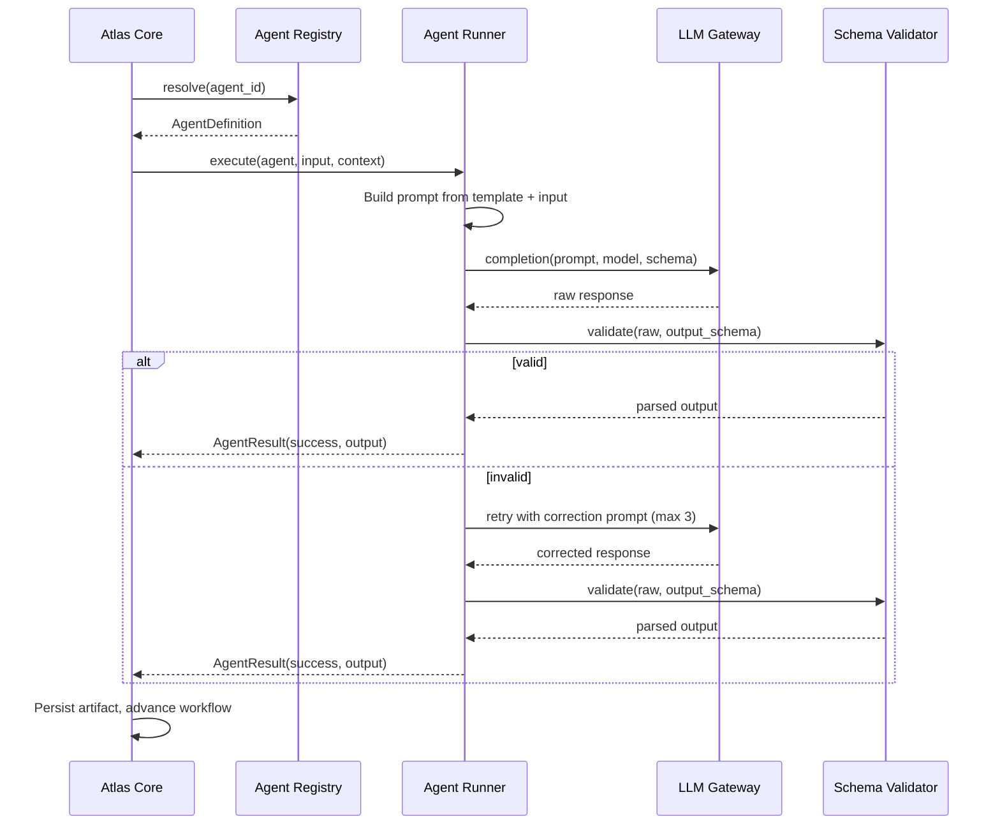
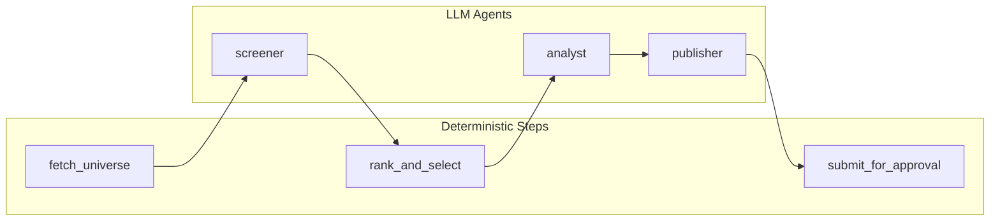
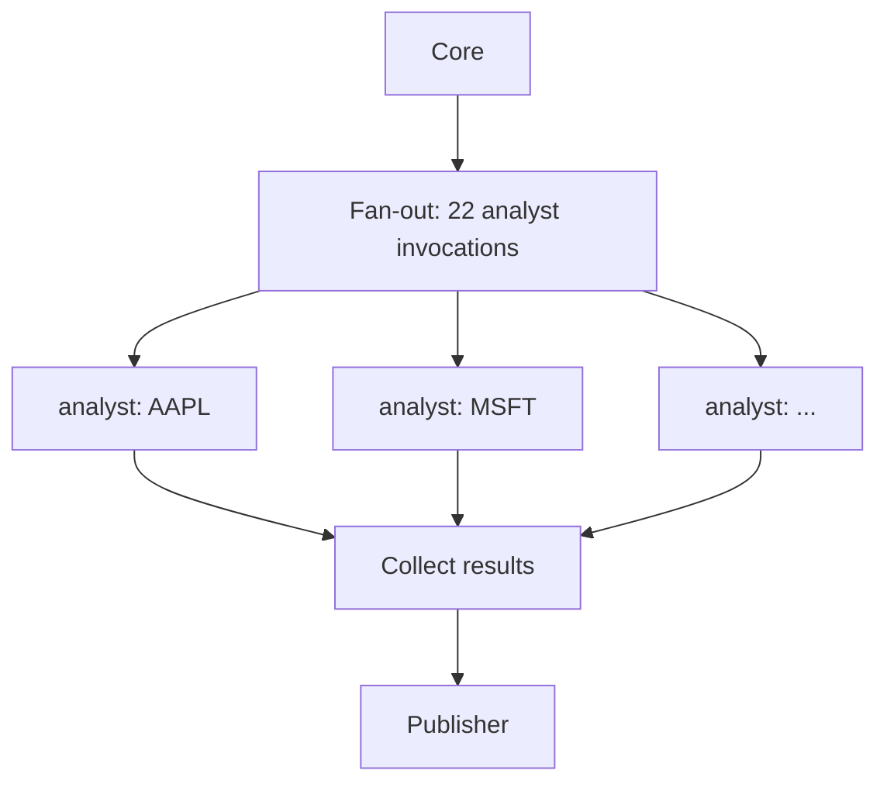

# Atlas OS — Agent Architecture

**Version:** 1.0  
**Status:** Draft

---

## 1. Overview

Atlas OS agents are **specialized, bounded workers** invoked by Atlas Core to perform discrete steps within a workflow. Agents are not autonomous loops or persistent personas — they receive structured input, produce structured output, and terminate.

Two agent classes exist:

| Class | Description | LLM Required | Example |
|-------|-------------|--------------|---------|
| **Deterministic step** | Pure code; no LLM | No | `fetch_universe`, `rank_and_select` |
| **LLM agent** | Prompt-driven with schema-validated output | Yes | `screener`, `analyst`, `publisher` |

This document defines agent design, lifecycle, communication patterns, and the GreenRock MVP agent roster.

---

## 2. Design Principles

| Principle | Description |
|-----------|-------------|
| **Single responsibility** | One agent, one job per workflow step |
| **Structured I/O** | All inputs and outputs are typed JSON (Pydantic models) |
| **Schema validation** | LLM output validated against JSON Schema; retry on failure |
| **Stateless execution** | Agents hold no memory between invocations; context passed explicitly |
| **No side effects without Core** | Agents do not send email, write to DB, or publish — Core handles persistence |
| **Prompt as config** | Prompts live in `agents/` as version-controlled markdown |
| **Human gate for exposure** | Agents producing client-facing content always route through approval |

---

## 3. Agent Lifecycle



### Context Object

Every agent invocation receives a `RunContext`:

```python
@dataclass
class RunContext:
    run_id: str
    workflow_id: str
    step_id: str
    division: str
    prior_artifacts: dict[str, ArtifactRef]  # step_id → artifact path
    config: dict                              # workflow + division config
    criteria_version: str | None              # e.g., "v1.0"
```

---

## 4. Agent Registry

Central index at `agents/registry.yaml`:

```yaml
agents:
  - id: screener
    division: greenrock
    type: llm
    path: agents/screener/

  - id: analyst
    division: greenrock
    type: llm
    path: agents/analyst/

  - id: publisher
    division: greenrock
    type: llm
    path: agents/publisher/

  # Future
  - id: batsignal.modeler
    division: batsignal
    type: llm
    path: agents/batsignal/modeler/
    enabled: false
```

Core resolves agents by ID at runtime. Disabled agents cannot be invoked.

---

## 5. Agent Definition Schema

Each agent directory contains:

```
agents/{agent_id}/
├── agent.yaml           # Metadata
├── system_prompt.md     # Prompt template (Jinja2)
├── output_schema.json   # JSON Schema
└── tools.yaml           # Optional tool definitions
```

### `agent.yaml` Fields

| Field | Required | Description |
|-------|----------|-------------|
| `id` | Yes | Unique agent identifier |
| `division` | Yes | Owning division |
| `description` | Yes | Human-readable purpose |
| `model` | Yes | LLM model identifier |
| `temperature` | No | Default 0.2 |
| `max_tokens` | No | Default 4096 |
| `prompt` | Yes | Filename of system prompt |
| `output_schema` | Yes | Filename of JSON Schema |
| `tools` | No | List of tool IDs |
| `retry_on_validation_failure` | No | Default true, max 3 |

---

## 6. GreenRock MVP Agent Roster

### 6.1 Workflow Agent Map



### 6.2 Agent Specifications

#### `screener`

| Attribute | Value |
|-----------|-------|
| **Purpose** | Interpret screening criteria against universe data; flag edge cases requiring human note |
| **Input** | Universe snapshot (symbols, market caps, OHLCV summary), criteria config |
| **Output** | Per-symbol screening notes, anomaly flags, confidence scores |
| **Model tier** | Standard (cost-efficient; structured output) |
| **Tools** | None (data pre-fetched by deterministic step) |

**Output schema (summary):**

```json
{
  "symbols": [
    {
      "symbol": "AAPL",
      "bucket": "large_cap",
      "score": 0.87,
      "signals": { "trend_strength": 0.9, "momentum": 0.82 },
      "flags": [],
      "note": "Strong uptrend with volume confirmation"
    }
  ]
}
```

#### `analyst`

| Attribute | Value |
|-----------|-------|
| **Purpose** | Draft per-stock research commentary for selected names |
| **Input** | Top 22 symbols with screening scores and notes |
| **Output** | Per-symbol analysis: thesis, key levels, risk factors |
| **Model tier** | High (quality prose; longer context) |
| **Tools** | None |

**Output schema (summary):**

```json
{
  "analyses": [
    {
      "symbol": "AAPL",
      "bucket": "large_cap",
      "thesis": "...",
      "key_levels": { "support": 180.0, "resistance": 195.0 },
      "risk_factors": ["..."],
      "catalyst": "..."
    }
  ]
}
```

**Constraints (prompt-enforced):**

- Commentary must reference provided data fields only
- No price targets presented as guarantees
- Include standard disclaimer reference

#### `publisher`

| Attribute | Value |
|-----------|-------|
| **Purpose** | Assemble final report from analyses into formatted Markdown |
| **Input** | Analyses array, report metadata (date, criteria version) |
| **Output** | Complete report Markdown, table of contents, section ordering |
| **Model tier** | Standard |
| **Tools** | None |

**Output schema (summary):**

```json
{
  "title": "GreenRock Analysts Monthly Report — June 2026",
  "generated_at": "2026-06-01T10:30:00Z",
  "criteria_version": "v1.0",
  "markdown": "# GreenRock Analysts Monthly Report\n\n...",
  "sections": ["large_cap", "small_cap", "disclaimer"]
}
```

---

## 7. Deterministic Steps vs. LLM Agents

Not every workflow step needs an LLM. The division between deterministic and LLM work is intentional:

| Step | Type | Rationale |
|------|------|-----------|
| `fetch_universe` | Deterministic | API call + data normalization; no judgment |
| `apply_screening` | Deterministic | Rule-based scoring; reproducible |
| `rank_and_select` | Deterministic | Sort and slice; no prose |
| `screener` (LLM) | LLM | Edge case interpretation, anomaly notes |
| `analyst` | LLM | Narrative commentary |
| `publisher` | LLM | Report assembly and formatting |
| `submit_for_approval` | Deterministic | Core approval gate |

**Rule:** If output must be bitwise reproducible, use deterministic code. Use LLM agents only where judgment or prose is required.

---

## 8. Prompt Engineering Standards

### Template Structure

```markdown
# Role
You are the {agent_id} agent for Atlas OS, division: {division}.

# Task
{task_description}

# Input
{{ input | tojson }}

# Constraints
- Output MUST conform to the provided JSON schema
- Do not fabricate data not present in input
- {division_specific_constraints}

# Output
Return valid JSON matching the output schema. No markdown wrapping.
```

### Versioning

- Prompts are version-controlled in git.
- Breaking prompt changes require a version bump in `agent.yaml`.
- Core logs prompt version (git SHA or explicit version field) per run.

---

## 9. Tool Architecture (Future)

Phase 1 agents use no tools (all data pre-fetched). Future agents may bind tools:

```yaml
# agents/batsignal/modeler/tools.yaml
tools:
  - id: fetch_player_stats
    handler: batsignal.data.fetch_player_stats
    description: Retrieve player stats for a given date
  - id: compute_reversion
    handler: batsignal.analysis.reversion.compute
    description: Calculate reversion metrics
```

Tool execution flows through Core:

1. Agent requests tool call (structured)
2. Core validates tool against agent's allowed list
3. Core executes handler, returns result to agent
4. Agent continues completion

This prevents agents from executing arbitrary code.

---

## 10. Multi-Agent Coordination Patterns

Atlas OS uses **sequential pipeline** pattern for Phase 1. Future patterns:

| Pattern | Use Case | Phase |
|---------|----------|-------|
| **Sequential pipeline** | Monthly report (MVP) | 1 |
| **Parallel fan-out** | Analyze 22 stocks concurrently | 2 |
| **Review loop** | Rejection → revision → re-approval | 2 |
| **Supervisor** | Core delegates to sub-agents dynamically | 3 |
| **Scheduled batch** | Daily Bat Signal across all games | 2 |

### Parallel Fan-Out (Phase 2)



Core manages concurrency limits (e.g., max 5 parallel LLM calls).

---

## 11. Error Handling

| Failure | Agent Behavior | Core Behavior |
|---------|----------------|---------------|
| LLM timeout | Runner retries (3x) | Log; fail step if exhausted |
| Schema validation failure | Correction prompt retry | Log raw response for debug |
| Empty output | Fail immediately | Mark step failed |
| Token limit exceeded | Truncate input or fail | Alert operator |
| Model unavailable | Failover to backup model (Phase 2) | Log model switch |

---

## 12. Cost Management

| Control | Implementation |
|---------|----------------|
| Token logging | `core/llm/token_tracker.py` records per-agent, per-run usage |
| Model tiering | High-tier models only for `analyst`; standard for others |
| Batch parallel limits | Cap concurrent LLM calls |
| Budget alerts | Configurable monthly token budget with warning threshold |

---

## 13. Testing Strategy

| Test Type | Scope |
|-----------|-------|
| Schema validation | Every agent output schema has fixture-based tests |
| Prompt regression | Snapshot tests with fixed inputs (no live LLM in CI) |
| Integration | End-to-end workflow with mocked LLM responses |
| Live eval | Manual monthly run against real LLM before production |

CI must not call live LLM APIs. Use recorded responses (VCR/cassettes).

---

## 14. Future Agent Roster (Preview)

| Agent | Division | Purpose |
|-------|----------|---------|
| `batsignal.data` | Bat Signal | Normalize daily game/player data |
| `batsignal.modeler` | Bat Signal | HR/HRR/reversion probabilities |
| `batsignal.risk` | Bat Signal | Bankroll sizing |
| `batsignal.publisher` | Bat Signal | Daily brief assembly |
| `insurance.crm` | Insurance | Prospect/policy record updates |
| `insurance.scheduler` | Insurance | Follow-up and renewal task generation |
| `insurance.comms` | Insurance | Draft carrier/client messages |
| `variance.*` | Variance Capital | TBD |

---

## Related Documents

- [PRD.md](./PRD.md)
- [SYSTEM_ARCHITECTURE.md](./SYSTEM_ARCHITECTURE.md)
- [REPOSITORY_STRUCTURE.md](./REPOSITORY_STRUCTURE.md)
- [IMPLEMENTATION_ROADMAP.md](./IMPLEMENTATION_ROADMAP.md)
