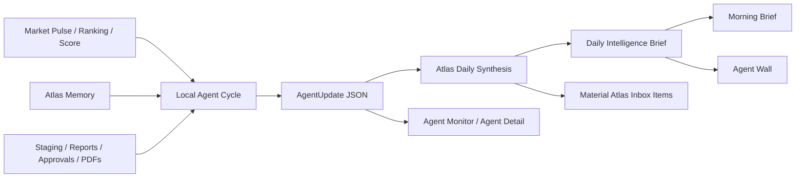

# Atlas Agent Orchestration

Phase 8A introduces the first real Atlas OS agent orchestration layer. Agents are local, safe, inspectable workflow operators. They coordinate existing Atlas OS surfaces without becoming autonomous external actors.

## Safe Local Mode

Agents may:

- Read local Atlas OS workflow state.
- Create local agent run records.
- Create local Atlas Inbox items.
- Create local snapshots or local artifacts only when an explicit workflow already permits them.
- Point the operator to approval-gated next steps.

Agents may not:

- Send email.
- Publish or distribute material.
- Trade or place broker/API orders.
- Read or write client files.
- Commit credentials.
- Call external LLM/API services.
- Bypass report approval gates.
- Bypass PDF export gates.

Report Agent can say `Report draft can be generated` when staging and analytics are ready. It does not generate a report automatically. The operator must still invoke the existing report workflow, approve the draft, and export any PDF explicitly.

## Agent Model

Each configured agent has:

- `agent_id`
- `name`
- `division`
- `responsibility`
- `status`: `idle`, `running`, `completed`, `failed`, or `blocked`
- `last_run_at`
- `last_message`
- `current_task`
- `output_summary`
- `health`

Configured agents:

- Market Agent: checks provider status, references the latest Market Pulse scan, and reports universe size, scored count, skipped count, and provider failures.
- Evidence Agent: summarizes latest Market Pulse evidence and identifies top rank movers, score improvers, confidence improvers, and evidence improvers.
- Fundamental Agent: reviews Fundamental Guardrails for strongest support, red flags with strong technical scores, changes, and missing data. It does not run valuation models.
- Memory Agent: verifies Atlas Memory state, summarizes scan-history changes, and identifies new archetype leaders.
- Report Agent: checks Analyst Slate/staging readiness and recommends whether a report draft can be generated. It does not generate the report.
- QA Agent: flags provider failures, missing analytics, underfilled or overfilled staging buckets, pending approvals, and approved reports missing PDFs.
- Inbox Agent: turns safe findings into local Atlas Inbox items.

## Agent Runs

Run records are stored locally as JSON:

```text
.atlas/output/agents/runs/<run_id>.json
.atlas/output/agents/cycles/<cycle_id>.json
.atlas/output/agents/agent_state.json
```

Each run records:

- `run_id`
- `agent_id`
- `started_at`
- `completed_at`
- `status`
- `inputs`
- `outputs`
- `warnings`
- `errors`
- `related_scan_id`
- `related_report_run_id`
- `related_approval_id`

## Cycle Flow

`atlas agents run` executes agents sequentially:

```text
Market -> Evidence -> Fundamental -> Memory -> Report -> QA -> Inbox
```

The cycle is deliberately deterministic and local. Later agents can reference prior agent outputs from the same cycle. The Inbox Agent runs last so it can convert findings into operator-visible local items.

## Daily Intelligence Cycle

Phase 9A adds the Daily Intelligence Cycle as the operator-facing synthesis layer:

```bash
atlas daily
atlas daily --market-scan-policy use_latest_scan
atlas daily --market-scan-policy run_if_stale --stale-hours 24
atlas daily --market-scan-policy run_fresh_scan
atlas daily history
atlas daily show <daily_id>
```

The daily cycle:

- inspects provider/system health
- applies the explicit Market Agent scan policy
- runs the coordinated local agent cycle
- stores structured agent updates
- synthesizes the Daily Intelligence Brief
- creates only material deduplicated Atlas Inbox items
- saves a local Morning Brief snapshot

Daily records live under:

```text
.atlas/output/atlas/daily/
.atlas/output/agents/updates/
```

## Agent Tasks

Phase 9B adds local task records for report-production work:

```text
.atlas/output/agents/tasks/
```

Each task includes `task_id`, `agent_id`, title, status, created/updated timestamps, input/output summaries, related scan/daily/report/approval IDs, target URL, and any operator action required.

GreenRock report tasks are refreshed by `/greenrock/report-workbench` and:

```bash
atlas greenrock report-workbench
atlas greenrock report-tasks
atlas greenrock report-task <task_id>
atlas greenrock report-ready
```

Task responsibilities:

- Market Agent verifies the latest scan, stale policy, and scan health.
- Evidence Agent reviews Market Pulse leaders and weak evidence candidates.
- Memory Agent identifies rank, score, confidence, and evidence movers relevant to the report.
- Fundamental Agent flags Red Flag guardrails and strongest balance-sheet support among report candidates.
- Report Agent prepares the recommended Analyst Slate workflow and recommends draft generation only when ready or explicitly underfilled.
- QA Agent checks missing analytics, underfilled buckets, provider failures, stale scans, duplicate tickers, logos, source disclosure, and approval state.
- Inbox Agent creates only material report workflow actions.

Agents may recommend and prepare local staging or approval-gated drafts through existing operator-invoked workflows. They may not approve, export PDFs without approval, email, publish, trade, place broker/API orders, touch client files, use credentials, or bypass gates.

## GreenRock Report Workbench

`/greenrock/report-workbench` is the single local page for one GreenRock report production workflow. It shows:

- latest successful scan
- Market Pulse status
- Daily Intelligence status
- staged Analyst Slate
- readiness checks
- pending approvals
- PDF status
- agent recommendations
- next operator action

Deterministic readiness states:

- `Not Ready`
- `Needs Review`
- `Ready to Draft`
- `Draft Awaiting Approval`
- `Approved, PDF Ready`
- `Final PDF Complete`

Reasons include stale scan, staging underfilled, analytics missing, QA warnings, pending approval, and approved-but-missing PDF.

The workbench controls route to the existing safe local actions: Run Daily Intelligence Cycle, Stage Analyst Slate, Enrich Staged Candidates, Generate Draft From Staging, Open Latest Review Center, Review Pending Approvals, Export Approved PDF, and Open Final Reports.

Structured `AgentUpdate` records include `update_id`, `cycle_id`, `agent_name`, timestamps, status, severity, headline, summary, findings, supporting metrics, related tickers, scan/report/approval links, recommended operator action, target URL, and provenance. The update records are deterministic local JSON files.

The Daily Intelligence Brief includes:

- Executive Summary
- What Changed
- Today's Research Priorities, capped at five
- Agent Updates
- Operator Actions, capped at five
- prior daily-cycle comparison

Atlas synthesis consumes existing canonical outputs: Market Pulse scan rows, Ranking, Score fields, Evidence Agreement, Atlas Memory, staging readiness, approvals, report records, PDF artifacts, provider diagnostics, and Inbox state. It does not duplicate GreenRock scoring or ranking logic.

Architecture:



## Market Agent Scan Policy

The Market Agent does not automatically pull fresh data by default. Its default safe policy is:

```text
use_latest_scan
```

Policies:

- `use_latest_scan`: reference the latest successful scan only. This is the default.
- `run_fresh_scan`: run a new local Market Pulse/population scan.
- `run_if_stale`: run a new local scan only if the latest scan is older than the stale threshold.

The stale threshold defaults to 24 hours.

CLI:

```bash
atlas agents run --market-scan-policy use_latest_scan
atlas agents run --market-scan-policy run_fresh_scan
atlas agents run --market-scan-policy run_if_stale --stale-hours 24
```

Cycle output records:

- market scan policy used
- latest scan ID referenced
- whether fresh data was pulled
- scan age
- stale threshold
- reason

Use fresh scans only when the operator intentionally wants current provider data. Fresh scans remain local-only and do not email, publish, trade, create client files, approve reports, bypass gates, or export PDFs.

## Dev Bootstrap

Use the local bootstrap scripts when setting up a workstation or when the `atlas` launcher points at stale Python paths:

```bash
./scripts/atlas-dev
./scripts/atlas-serve
```

The scripts run Atlas through `python3 -m atlas_os.cli`, which avoids stale console-script issues such as `ModuleNotFoundError: No module named 'atlas_os'`. They create or reuse `.venv`, install the editable package with market-data extras, ensure local `.env` exists, run Doctor, and start the local server without enabling email, publishing, trading, client-file actions, external LLM/API calls, or approval bypasses.

After a cycle, Atlas writes a cycle summary with:

- `cycle_id`
- `started_at`
- `completed_at`
- completed, failed, and blocked agent counts
- inbox items created
- warnings
- top operator actions
- run IDs
- cycle-to-cycle diff

The diff compares the latest cycle with the prior summary:

- new inbox items
- resolved or dismissed items
- new provider failures
- changed pending approval counts
- new scan and memory changes
- report readiness changes

CLI:

```bash
atlas agents list
atlas agents run
atlas agents status
atlas agents cycles
atlas agents cycle <cycle_id>
atlas agents show <run_id>
```

Browser:

- `/agents` shows cards, status, task, latest message, health, output summary, and run history.
- `/agents/<agent_id>` shows local structured update history for that agent.
- `/atlas/wall` shows the office-TV Agent Wall with large agent cards, provider status, latest Daily Intelligence cycle, executive summary, top priorities, QA health, latest cycle, Inbox counts, Market Pulse summary, Morning Brief snapshot status, approvals, and PDF readiness.
- `/` shows the Agent Cycle card and a confirmed `Run Agent Cycle` action.
- `/atlas/morning-brief` shows the Daily Intelligence Brief first, followed by latest agent run summary, health cards, inbox items, and Last Agent Cycle timestamp.
- `/atlas/inbox` and inbox detail pages show provenance, status, created reason, related run/cycle context where available, target URL, and local dismiss/complete actions.

### Wall Mode UX

`/atlas/wall` is intended for a 16:9 office TV. The page uses a fixed-height local display layout with:

- header, local clock, logos, and provider status
- navigation/action row directly under the header
- top intelligence row for Daily Intelligence, priorities, cycle signals, and Atlas Inbox
- Agent Room with consistent agent cards and update history indicators
- bottom status grid for provider, latest cycle, Market Pulse, approvals, report readiness, report tasks, pending approval, and PDF status

The wall limits lists to the newest/top items and shows `+N more` when needed. Long text is clipped to keep the screen readable. Future integrations are displayed as local placeholders only: Slack is planned/not configured, and email, publishing, and trading remain disabled.

## Atlas Inbox

Atlas Inbox is local item storage for operator attention:

```text
.atlas/output/atlas/inbox/items.json
```

Fields:

- `item_id`
- `created_at`
- `source_agent`
- `severity`: `info`, `warning`, `critical`, or `action`
- `title`
- `detail`
- `target_url`
- `status`: `open`, `dismissed`, or `completed`
- `updated_at`
- `related_agent_run_id`
- `related_cycle_id`
- `related_scan_id`
- `related_report_run_id`
- `related_approval_id`
- `created_reason`

Inbox lists sort newest open items first by default. Browser and CLI views show created date/time, updated date/time, source agent, related cycle, status, severity, and the reason the item exists.

CLI:

```bash
atlas inbox list
atlas inbox show <item_id>
atlas inbox dismiss <item_id>
atlas inbox complete <item_id>
```

Browser:

- `/atlas/inbox` lists open items and supports local dismissal/completion.
- `/atlas/inbox/<item_id>` shows provenance and why the item exists.
- The dashboard and Morning Brief surface open agent-created items.

Inbox Agent may create items such as:

- Review latest Market Pulse
- Stage Analyst Slate
- Review pending approval
- Export approved PDF
- Provider failures require cleanup
- Staging underfilled
- Morning Brief snapshot available

## Approval Gates

Agents never approve, reject, publish, export PDFs, or create client-facing files. Approval and PDF export remain explicit operator actions:

```text
Generate Draft -> Human Approval -> Export PDF
```

Agent output can recommend a next step or link to a local page, but it cannot cross the gate.

## Future Autonomy Roadmap

Future phases can add more autonomy only by preserving the same gate model:

- Phase 8B: richer agent health diagnostics and cycle comparison snapshots. Complete.
- Phase 8C: stabilized cycle intelligence, inbox show/complete commands, provenance polish, and score-audit support. Complete.
- Phase 8D: operator-configurable agent schedules that still run local-only.
- Phase 9: optional external integrations only after credentials, permissions, audit logging, compliance, and per-action human approval are designed.

Until those controls exist, Atlas agents remain local workflow operators only.
