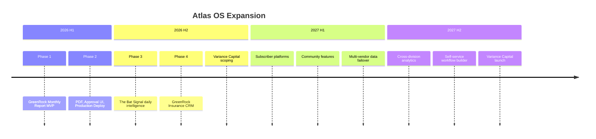
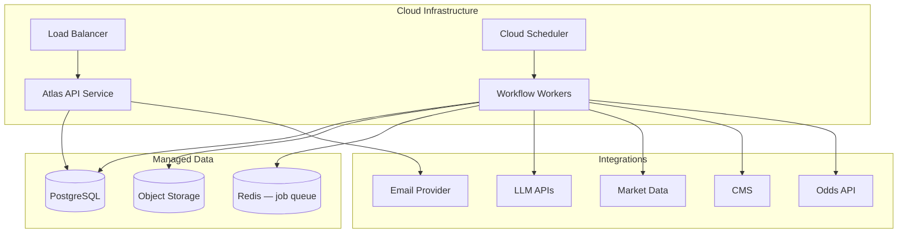

# Atlas OS — Future Expansion Roadmap

**Version:** 1.0  
**Status:** Draft

---

## 1. Vision

Atlas OS evolves from a single-division report automation tool (GreenRock Analysts) into a **multi-division AI operating system** orchestrating research, betting intelligence, insurance operations, and investment management workflows — all governed by a unified approval layer and shared agent infrastructure.

This document covers expansion beyond Phase 1 MVP through a 24-month horizon.

---

## 2. Expansion Timeline



---

## 3. Division Expansion Plans

### 3.1 GreenRock Analysts — Beyond MVP

| Feature | Description | Phase | Priority |
|---------|-------------|-------|----------|
| Options analysis | Options chain screening, implied vol analysis for selected names | 2 | P2 |
| PDF generation | Branded PDF from approved Markdown | 2 | P1 |
| Subscriber delivery | Email report to subscriber list with unsubscribe | 2–3 | P2 |
| Website publication | Auto-publish approved report to GreenRock website/CMS | 3 | P2 |
| Intra-month updates | Ad-hoc re-screening when major market events occur | 3 | P3 |
| Historical archive | Searchable archive of past reports and selections | 3 | P2 |
| Performance tracking | Track selected stocks' performance post-publication | 3 | P2 |
| Custom criteria profiles | Multiple screening profiles (aggressive, conservative) | 4 | P3 |

### 3.2 The Bat Signal

| Feature | Description | Phase | Priority |
|---------|-------------|-------|----------|
| Daily intelligence brief | Reversion, HR, HRR probabilities + bankroll sizing | 3 | P0 |
| Data ingestion | MLB game schedules, lineups, player stats, odds | 3 | P0 |
| Probability models | Reversion stats, HR probability, HRR probability | 3 | P0 |
| Bankroll management | Kelly criterion or fixed-fraction sizing rules | 3 | P0 |
| Results tracking | Log picks vs. outcomes; ROI dashboard | 3–4 | P1 |
| Subscription tiers | Free / premium / VIP content gating | 4 | P2 |
| Community access | Discord or forum integration for subscribers | 4 | P3 |
| Live odds integration | Real-time odds feed for edge calculation | 4 | P2 |
| Parlay builder | Multi-leg bet construction with correlation awareness | 5 | P3 |

**Workflow:** `batsignal.daily_intelligence` — scheduled daily at 10:00 ET (before first pitch).

**Agents:**

| Agent | Role |
|-------|------|
| `batsignal.data` | Ingest and normalize game/player data |
| `batsignal.modeler` | Compute probabilities |
| `batsignal.risk` | Bankroll sizing and exposure limits |
| `batsignal.publisher` | Assemble daily brief |

### 3.3 GreenRock Insurance

| Feature | Description | Phase | Priority |
|---------|-------------|-------|----------|
| Prospect pipeline | Status tracking, notes, next-action dates | 4 | P0 |
| Policy registry | Carrier, coverage type, term, premium, renewal date | 4 | P0 |
| Renewal reminders | Automated task generation 60/30/7 days before renewal | 4 | P0 |
| Carrier follow-ups | Task queue for pending carrier responses | 4 | P0 |
| Draft communications | AI-drafted follow-up emails (approval-gated) | 4–5 | P1 |
| Response tracking | Log carrier replies; update prospect status | 5 | P1 |
| Renewal workflow | End-to-end renewal automation with approval | 5 | P2 |
| Document storage | Policy documents, applications, correspondence | 5 | P2 |
| Compliance logging | Audit trail for all client communications | 5 | P1 |

**Workflows:**

- `insurance.renewal_reminders` — daily scan
- `insurance.carrier_followup` — daily scan
- `insurance.draft_comms` — on-demand per task

### 3.4 Variance Capital

| Feature | Description | Phase | Priority |
|---------|-------------|-------|----------|
| Scope definition | Define VC mandate, workflows, and data needs | 4 | P0 |
| Portfolio monitoring | TBD based on mandate | 5+ | TBD |
| Research automation | TBD — may share GreenRock screening infra | 5+ | TBD |
| Reporting | TBD | 5+ | TBD |

**Status:** Placeholder division. No implementation until scope workshop completed.

**Architectural note:** Variance Capital will use `variance/` directory and share Atlas Core. It may reuse GreenRock data adapters if mandates overlap.

---

## 4. Platform Expansion

Features that span all divisions.

### 4.1 Orchestration & Core

| Feature | Description | Phase |
|---------|-------------|-------|
| Parallel step execution | Fan-out/fan-in for independent agent calls | 2 |
| Workflow versioning | Run workflows at specific version; rollback | 3 |
| Event webhooks | Notify external systems on run completion | 3 |
| Workflow builder UI | Self-service workflow creation (no-code) | 5+ |
| Cross-division scheduling | Unified calendar view of all division runs | 4 |
| Retry policies per step | Configurable retry/backoff per workflow step | 2 |

### 4.2 Approval & Governance

| Feature | Description | Phase |
|---------|-------------|-------|
| Web approval UI | Review artifacts, approve/reject with comments | 2 |
| Multi-approver workflows | Require 2+ approvers for sensitive content | 4 |
| Approval delegation | Temporary delegate during absence | 4 |
| Content diff view | Show changes between draft versions | 3 |
| Compliance export | Export approval audit log for regulators | 5 |

### 4.3 Agent Platform

| Feature | Description | Phase |
|---------|-------------|-------|
| Tool binding | Agents call division functions via Core | 3 |
| Agent eval framework | Automated quality scoring of agent outputs | 3 |
| Prompt A/B testing | Compare prompt versions on same input | 4 |
| Model routing | Auto-select model tier based on task complexity | 3 |
| Agent marketplace | Internal catalog of reusable agents | 5+ |

### 4.4 Data & Integrations

| Feature | Description | Phase |
|---------|-------------|-------|
| Multi-vendor failover | Secondary market data provider | 3 |
| Unified data lake | Cross-division historical data store | 4 |
| CRM integration | Salesforce or HubSpot connector (Insurance) | 5 |
| Email provider | SendGrid/SES for subscriber delivery | 3 |
| CMS integration | WordPress/Webflow for report publication | 4 |
| Odds API integration | Bat Signal live odds feed | 4 |

### 4.5 Observability & Operations

| Feature | Description | Phase |
|---------|-------------|-------|
| Operations dashboard | Run status, failure rates, token costs | 3 |
| Alerting (Slack/email) | Failure and approval-pending notifications | 2 |
| Cost dashboard | Per-division LLM and API spend | 3 |
| SLA monitoring | Track workflow completion against deadlines | 4 |
| Disaster recovery | Backup/restore for DB and artifacts | 3 |

---

## 5. Monetization & Delivery Expansion

| Feature | Division | Phase |
|---------|----------|-------|
| Email subscriber list management | GreenRock, Bat Signal | 3 |
| Stripe subscription billing | Bat Signal | 4 |
| Tiered content gating | Bat Signal | 4 |
| Public API for subscribers | Bat Signal | 5 |
| White-label report branding | GreenRock | 5 |

---

## 6. Architecture Evolution

### Current (Phase 1)

```
Single host → SQLite → Local filesystem → CLI
```

### Target (Phase 3+)



### Migration Path

| From | To | Trigger |
|------|----|---------|
| SQLite | PostgreSQL | Phase 2 production deploy |
| Local FS | S3 | Phase 2 artifact volume |
| Cron | Cloud scheduler | Phase 2 production deploy |
| Sequential agents | Parallel fan-out | Phase 2 (22-stock analysis) |
| CLI-only approval | Web UI | Phase 2 |
| Single LLM provider | Multi-provider gateway | Phase 3 |

---

## 7. Risk Register (Expansion)

| Risk | Phase | Mitigation |
|------|-------|------------|
| Bat Signal model accuracy | 3 | Backtest before publishing; disclaimer; track record |
| Insurance compliance (TCPA, state regs) | 4 | Legal review before comms automation |
| LLM cost at scale (daily + monthly) | 3 | Model tiering, caching, budget caps |
| Subscriber data privacy | 3 | Separate PII store; encryption at rest |
| Variance Capital scope creep | 4 | Formal scope workshop before any code |
| Vendor lock-in (LLM, data) | 2+ | Abstract interfaces; multi-provider from start |

---

## 8. Success Metrics (24-Month)

| Metric | Target |
|--------|--------|
| Divisions operational | 4 |
| Scheduled workflows running | ≥6 |
| Client-facing sends without approval | 0 |
| Monthly report manual effort reduction | ≥75% |
| Bat Signal daily brief delivery rate | ≥99% |
| Insurance renewal reminders automated | ≥90% of policies |
| Platform uptime | ≥99.5% |
| Mean time to onboard new workflow | <2 weeks |

---

## 9. Open Strategic Questions

| # | Question | Impact | Target Resolution |
|---|----------|--------|-------------------|
| SQ-1 | Variance Capital mandate and workflow scope | Division design | Q3 2026 |
| SQ-2 | Build vs. buy for subscriber platform | Bat Signal monetization | Q4 2026 |
| SQ-3 | Insurance CRM: custom vs. Salesforce integration | Phase 4 architecture | Q3 2026 |
| SQ-4 | Self-service workflow builder: priority vs. depth | Platform roadmap | Q1 2027 |
| SQ-5 | Multi-tenant: support external clients or internal only? | Security, isolation | Q2 2027 |

---

## Related Documents

- [PRD.md](./PRD.md)
- [SYSTEM_ARCHITECTURE.md](./SYSTEM_ARCHITECTURE.md)
- [IMPLEMENTATION_ROADMAP.md](./IMPLEMENTATION_ROADMAP.md)
- [AGENT_ARCHITECTURE.md](./AGENT_ARCHITECTURE.md)
