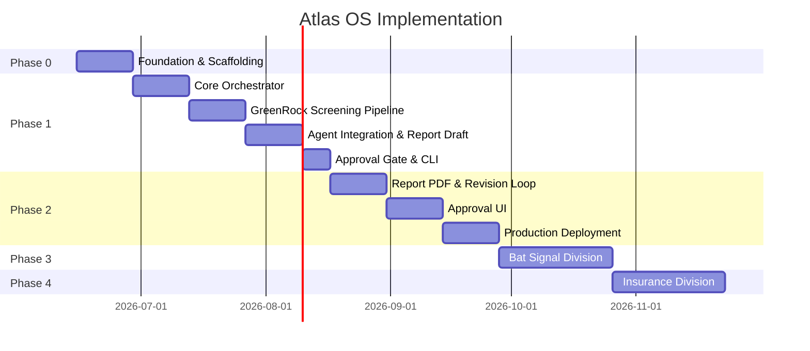

# Atlas OS — Implementation Roadmap

**Version:** Historical planning baseline

**Status:** Superseded for active sequencing by [`../ROADMAP.md`](../ROADMAP.md)

**Original Target:** GreenRock Analysts Monthly Report

> This document preserves the initial phase plan and is not a current statement of implemented capability. Several listed deliverables are now complete, while external LLM services, automatic distribution, and production deployment remain outside the current Atlas OS safety boundary. Use the root roadmap for current release status and next-version scope.

---

## 1. Roadmap Overview

> Dates are illustrative. Adjust based on team capacity and criteria sign-off.

---

## 2. Phase 0 — Foundation (Weeks 1–2)

**Goal:** Repository scaffolding, dev environment, and criteria documentation.

### Deliverables

| # | Deliverable | Owner | Exit Criteria |
|---|-------------|-------|---------------|
| 0.1 | Python project setup (`pyproject.toml`, virtualenv, linting) | Platform | `pip install -e .` succeeds |
| 0.2 | Directory structure per [REPOSITORY_STRUCTURE.md](./REPOSITORY_STRUCTURE.md) | Platform | All directories scaffolded |
| 0.3 | `.env.example` and settings module | Platform | Config loads from environment |
| 0.4 | GreenRock screening criteria v1.0 documented and signed off | Research | `docs/divisions/greenrock/screening-criteria.md` approved |
| 0.5 | Market data vendor selected and API key provisioned | Operations | Test API call returns data |
| 0.6 | SQLite database schema (runs, approvals, artifacts) | Platform | Migrations run cleanly |
| 0.7 | Basic CLI skeleton (`atlas --help`) | Platform | CLI entry point works |

### Dependencies

- OQ-1 (screening criteria) — **blocking**
- OQ-2 (market data vendor) — **blocking**

### Risks

- Criteria sign-off delays → mitigate with placeholder criteria for dev/testing

---

## 3. Phase 1 — GreenRock MVP (Weeks 3–9)

**Goal:** End-to-end monthly report pipeline producing a draft for human approval.

### Phase 1A — Core Orchestrator (Weeks 3–4)

| # | Task | Exit Criteria |
|---|------|---------------|
| 1A.1 | Workflow loader (YAML → internal model) | Loads `greenrock/workflows/monthly_report.yaml` |
| 1A.2 | Workflow engine (sequential step execution) | Executes mock workflow end-to-end |
| 1A.3 | Run state machine (`pending → running → awaiting_approval → completed`) | State transitions persisted to DB |
| 1A.4 | Artifact store (local filesystem) | Steps read/write artifacts by run ID |
| 1A.5 | Structured logging (JSON, run-scoped) | Logs queryable by run ID |
| 1A.6 | Scheduler (cron-compatible trigger) | Manual + scheduled trigger works |

### Phase 1B — GreenRock Screening Pipeline (Weeks 5–6)

| # | Task | Exit Criteria |
|---|------|---------------|
| 1B.1 | Market data client (abstract + Polygon provider) | Fetches universe and OHLCV |
| 1B.2 | Universe builder (market cap split at $5B) | Produces large-cap / small-cap buckets |
| 1B.3 | Hard filters (volume, price, history) | Filters applied per criteria config |
| 1B.4 | Scoring signals (trend, RS, volume, momentum, volatility) | Weighted scores computed |
| 1B.5 | Ranker (top 11 per bucket) | Returns exactly 22 symbols |
| 1B.6 | Screening tests with fixture data | Unit tests pass; reproducible output |

### Phase 1C — Agent Integration (Weeks 7–8)

| # | Task | Exit Criteria |
|---|------|---------------|
| 1C.1 | Agent registry and runner | Loads agents from `agents/` |
| 1C.2 | LLM gateway (Anthropic/OpenAI) | Completion with token tracking |
| 1C.3 | Output schema validation with retry | Invalid output triggers correction |
| 1C.4 | `screener` agent (prompt + schema) | Produces screening notes for 22 symbols |
| 1C.5 | `analyst` agent (prompt + schema) | Produces per-stock commentary |
| 1C.6 | `publisher` agent (prompt + schema) | Assembles Markdown report |
| 1C.7 | Report template (Jinja2 fallback for publisher) | Report renders with all sections |

### Phase 1D — Approval Gate & CLI (Week 9)

| # | Task | Exit Criteria |
|---|------|---------------|
| 1D.1 | Approval queue (pending / approved / rejected) | Report enters queue after assembly |
| 1D.2 | CLI: `atlas run greenrock.monthly-report` | Triggers full workflow |
| 1D.3 | CLI: `atlas runs list` / `atlas runs show <id>` | Inspect run status and artifacts |
| 1D.4 | CLI: `atlas approve <run_id>` / `atlas reject <run_id>` | Human approval workflow works |
| 1D.5 | Integration test (mocked LLM, full pipeline) | CI green |
| 1D.6 | Runbook: `docs/runbooks/monthly-report-runbook.md` | Operator can run without developer |

### Phase 1 Milestone

**Definition of Done:**

- [ ] Scheduled monthly workflow runs unattended until approval step
- [ ] Draft report (Markdown) produced with 22 stocks, commentary, and disclaimers
- [ ] Report blocked in approval queue until human approves
- [ ] Full audit trail: run ID, step artifacts, agent logs, approval record
- [ ] Research team confirms draft quality is ≥50% less manual effort than baseline

---

## 4. Phase 2 — Production Hardening (Weeks 10–15)

**Goal:** PDF output, revision loop, approval UI, production deployment.

| # | Task | Priority |
|---|------|----------|
| 2.1 | PDF generation from approved Markdown | P1 |
| 2.2 | Rejection → revision → re-approval loop | P1 |
| 2.3 | Parallel analyst fan-out (22 concurrent) | P1 |
| 2.4 | Approval web UI (minimal) | P1 |
| 2.5 | PostgreSQL migration from SQLite | P1 |
| 2.6 | Object storage for artifacts (S3) | P1 |
| 2.7 | Email notifications (pending approval, failures) | P2 |
| 2.8 | REST API for runs and approvals | P2 |
| 2.9 | Cloud deployment (scheduler + service) | P1 |
| 2.10 | Options analysis module (GreenRock) | P2 |
| 2.11 | Config-driven criteria updates (no deploy) | P2 |

### Phase 2 Milestone

- [ ] Approved report available as PDF
- [ ] Approver uses web UI (not CLI)
- [ ] System runs in production environment on schedule
- [ ] Failure alerts delivered to operator

---

## 5. Phase 3 — The Bat Signal (Weeks 16–19)

**Goal:** Daily baseball betting intelligence brief.

| # | Task | Priority |
|---|------|----------|
| 3.1 | Bat Signal data ingestion (games, players, stats) | P0 |
| 3.2 | Reversion, HR, HRR probability modules | P0 |
| 3.3 | Bankroll management rules | P0 |
| 3.4 | Bat Signal agents (modeler, risk, publisher) | P0 |
| 3.5 | Daily workflow + scheduling | P0 |
| 3.6 | Approval gate for daily brief | P0 |
| 3.7 | Results tracking ledger | P1 |
| 3.8 | Subscription tier scaffolding | P2 |

See [FUTURE_EXPANSION_ROADMAP.md](./FUTURE_EXPANSION_ROADMAP.md) for Bat Signal detail.

---

## 6. Phase 4 — GreenRock Insurance (Weeks 20–23)

**Goal:** CRM automation and renewal reminders.

| # | Task | Priority |
|---|------|----------|
| 4.1 | Prospect and policy data models | P0 |
| 4.2 | CRM store (SQLite → PostgreSQL) | P0 |
| 4.3 | Renewal reminder workflow | P0 |
| 4.4 | Carrier follow-up task generation | P0 |
| 4.5 | Insurance comms agent (draft messages) | P1 |
| 4.6 | Approval gate for outbound messages | P0 |

---

## 7. Cross-Cutting Work (All Phases)

| Workstream | Phase 1 | Phase 2 | Phase 3+ |
|------------|---------|---------|----------|
| CI/CD (GitHub Actions) | Basic lint + test | Full pipeline | Deploy automation |
| Documentation | Runbooks | API docs | Division guides |
| Security review | Local-only | Auth + RBAC | Pen test |
| Cost monitoring | Token logging | Budget alerts | Dashboard |
| ADRs | Initial set | Per major decision | Ongoing |

---

## 8. Team & Roles (Suggested)

| Role | Responsibility | Phase 1 Involvement |
|------|----------------|---------------------|
| Platform engineer | Core, CLI, deployment | Full-time |
| Division engineer (GreenRock) | Screening, data, templates | Full-time |
| Research analyst | Criteria, prompt review, UAT | Part-time |
| Approver / principal | Approval workflow UAT | Part-time |
| Operations | Vendor accounts, hosting | Part-time |

---

## 9. Decision Gates

| Gate | When | Criteria to Proceed |
|------|------|---------------------|
| G0 → G1 | End of Phase 0 | Criteria signed off; vendor API working |
| G1 → G2 | End of Phase 1 | MVP report approved by research team |
| G2 → G3 | End of Phase 2 | Production deployment stable for 2 monthly cycles |
| G3 → G4 | End of Phase 3 | Bat Signal daily brief approved for 2 weeks |
| G4 → G5 | End of Phase 4 | Insurance renewal workflow operational |

---

## 10. What We Are Not Building (Phase 1)

- PDF generation
- Subscriber email delivery
- Website publication
- Approval web UI
- Bat Signal or Insurance workflows
- Variance Capital division
- Multi-tenant / multi-user auth
- Real-time data streaming

---

## Related Documents

- [PRD.md](./PRD.md)
- [SYSTEM_ARCHITECTURE.md](./SYSTEM_ARCHITECTURE.md)
- [AGENT_ARCHITECTURE.md](./AGENT_ARCHITECTURE.md)
- [FUTURE_EXPANSION_ROADMAP.md](./FUTURE_EXPANSION_ROADMAP.md)
