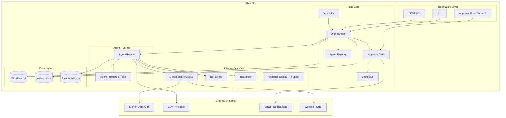
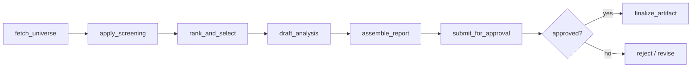
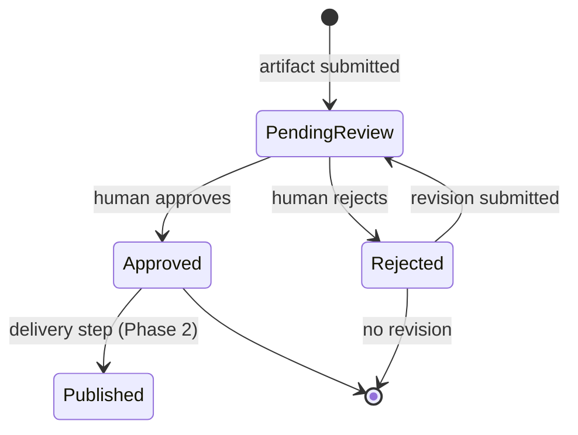

# Atlas OS — System Architecture

**Version:** 1.0  
**Status:** Draft

---

## 1. Architectural Overview

Atlas OS follows a **layered, event-driven architecture** with a central orchestration plane (Atlas Core) and isolated division domains. Agents are stateless workers invoked by Core; durable state lives in the data layer.



---

## 2. Architectural Principles

| Principle | Description |
|-----------|-------------|
| **Core owns orchestration; divisions own domain** | Core never encodes screening rules or insurance CRM logic |
| **Agents are composable workers** | Each agent has a single responsibility, defined I/O contract |
| **Approval before exposure** | No client-facing artifact leaves the system without passing the approval gate |
| **Everything is a workflow run** | Each execution gets a run ID, audit log, and artifact chain |
| **Config over code for business rules** | Screening criteria, schedules, and thresholds live in versioned config |
| **Fail closed** | Missing approval, failed validation, or agent error blocks downstream steps |

---

## 3. Layer Descriptions

### 3.1 Presentation Layer

| Component | Phase | Purpose |
|-----------|-------|---------|
| CLI | 1 | Trigger workflows, inspect runs, manage approvals |
| REST API | 1 | Programmatic access for automation and integrations |
| Approval UI | 2 | Web interface for reviewers |

Phase 1 prioritizes CLI + minimal API. UI deferred until approval workflow stabilizes.

### 3.2 Atlas Core

The orchestration plane. Responsibilities:

- **Workflow definition** — Declarative DAGs (directed acyclic graphs) per division workflow
- **Scheduling** — Cron-based triggers; manual invocation
- **Agent dispatch** — Resolve agent from registry, pass context, collect output
- **State management** — Track run status: `pending → running → awaiting_approval → completed | failed`
- **Approval gate** — Hold client-facing artifacts until human action
- **Event bus** — Internal events for logging, notifications, and future webhooks

### 3.3 Division Domains

Self-contained modules per business unit:

| Division | Package | Workflows |
|----------|---------|-----------|
| GreenRock Analysts | `greenrock/` | `monthly_report` |
| The Bat Signal | `batsignal/` | `daily_intelligence` |
| GreenRock Insurance | `insurance/` | `renewal_reminders`, `carrier_followup` |
| Variance Capital | `variance/` (future) | TBD |

Divisions expose:

- Workflow step implementations (pure functions / services)
- Domain-specific config schemas
- Data adapters (market data, CRM, etc.)

Divisions do **not** import from each other.

### 3.4 Agent Runtime

Executes LLM-backed and deterministic agents:

- Loads agent definition (prompt, tools, output schema)
- Injects run context (run ID, prior step artifacts)
- Validates output against JSON schema
- Returns structured result to Core

### 3.5 Data Layer

| Store | Technology (recommended) | Contents |
|-------|--------------------------|----------|
| Workflow DB | PostgreSQL (SQLite for local dev) | Runs, approvals, workflow metadata |
| Artifact Store | Local filesystem → S3-compatible object storage | Reports, screening CSVs, intermediate JSON |
| Structured Logs | JSON lines → log aggregator (Phase 2) | Agent traces, errors, timing |

---

## 4. Workflow Model

Workflows are defined as ordered steps with explicit dependencies.



### Workflow Definition (Conceptual)

```yaml
id: greenrock.monthly_report
version: "1.0"
schedule: "0 6 1 * *"  # 06:00 ET, first of month
division: greenrock
steps:
  - id: fetch_universe
    agent: null  # deterministic
    handler: greenrock.steps.fetch_universe
  - id: apply_screening
    agent: screener
    depends_on: [fetch_universe]
  - id: rank_and_select
    agent: null
    handler: greenrock.steps.rank_and_select
    depends_on: [apply_screening]
  - id: draft_analysis
    agent: analyst
    depends_on: [rank_and_select]
  - id: assemble_report
    agent: publisher
    depends_on: [draft_analysis]
  - id: submit_for_approval
    agent: null
    handler: core.approval.submit
    depends_on: [assemble_report]
    requires_approval: true
```

---

## 5. Approval Gate Architecture



**Rules:**

1. Artifacts with `requires_approval: true` cannot proceed to delivery steps.
2. Approval records are immutable (append-only audit log).
3. Approver identity and timestamp stored with each decision.
4. Rejection requires a comment (Phase 2).

---

## 6. Integration Architecture

### 6.1 Market Data (GreenRock)

```
Division Adapter (greenrock/data/)
    ↓
Vendor Client (abstract interface)
    ↓
Concrete Provider (Polygon, Alpha Vantage, etc.)
```

- Adapter normalizes vendor responses to internal types.
- Vendor swappable without changing screening logic.
- Rate limiting and caching at adapter layer.

### 6.2 LLM Providers

```
Agent Runtime
    ↓
LLM Gateway (core/llm/)
    ↓
Provider (OpenAI, Anthropic, etc.)
```

- Gateway handles retries, token counting, and model routing.
- Agent definitions specify model tier (e.g., `analysis: claude-sonnet`, `formatting: gpt-4o-mini`).

### 6.3 Notifications (Phase 2)

- Email on approval pending, run failure, run complete.
- Webhook support for external systems.

---

## 7. Security Architecture

| Concern | Approach |
|---------|----------|
| Secrets | Environment variables locally; secret manager in production |
| API auth | API key or JWT for REST endpoints (Phase 1: local-only, no auth) |
| Approval access | Role-based; approver list in config |
| Artifact access | Run-scoped paths; no public URLs without signed links |
| LLM data | No PII in prompts; market data only for GreenRock MVP |
| Audit | Immutable approval log; run artifacts versioned |

---

## 8. Deployment Architecture

### Phase 1 — Local / Single Host

```
┌─────────────────────────────────┐
│  Developer Machine / VPS        │
│  ┌───────────┐  ┌────────────┐  │
│  │ Scheduler │  │ Atlas Core │  │
│  │  (cron)   │→ │  + Agents  │  │
│  └───────────┘  └────────────┘  │
│        ↓              ↓         │
│  ┌───────────┐  ┌────────────┐  │
│  │  SQLite   │  │ Local FS   │  │
│  └───────────┘  └────────────┘  │
└─────────────────────────────────┘
```

### Phase 2 — Production

```
┌──────────────┐     ┌──────────────┐     ┌──────────────┐
│ Cloud        │     │ Atlas Core   │     │ PostgreSQL   │
│ Scheduler    │────→│ Service      │────→│ (managed)    │
└──────────────┘     └──────┬───────┘     └──────────────┘
                            │
                     ┌──────┴───────┐
                     │ Object Store │
                     │ (S3)         │
                     └──────────────┘
```

---

## 9. Error Handling & Resilience

| Scenario | Behavior |
|----------|----------|
| Step failure | Mark run failed; preserve partial artifacts; alert operator |
| Agent timeout | Retry up to 3 times with backoff |
| LLM invalid output | Schema validation failure → retry with correction prompt |
| Data vendor outage | Fail run; do not produce partial report |
| Approval timeout | Remain in pending; send reminder (Phase 2) |

---

## 10. Observability

| Signal | Phase 1 | Phase 2 |
|--------|---------|---------|
| Run status | CLI + DB query | Dashboard |
| Agent logs | Structured JSON to file | Centralized log search |
| Token usage | Per-run counter in DB | Cost dashboard |
| Alerts | Manual | Email / Slack on failure |

---

## 11. Technology Recommendations

> Recommendations only — final stack decision deferred to implementation kickoff.

| Layer | Recommendation | Rationale |
|-------|----------------|-----------|
| Language | Python 3.12+ | Strong data/ML ecosystem, fast iteration |
| Orchestration | Custom lightweight engine in `core/` | Division-specific needs; avoid heavyweight framework early |
| Workflow config | YAML + Pydantic validation | Human-readable, version-controlled |
| Database | SQLite (dev) → PostgreSQL (prod) | Simple start, production-grade path |
| LLM | Anthropic / OpenAI via unified gateway | Flexibility to swap models per agent |
| CLI | Typer or Click | Python-native, quick to build |
| Testing | pytest | Standard Python testing |

---

## 12. Architecture Decision Records (Initial)

| ADR | Decision | Rationale |
|-----|----------|-----------|
| ADR-001 | Monorepo | Shared Core, atomic cross-division changes |
| ADR-002 | Custom orchestrator over Temporal/Prefect for Phase 1 | Lower operational overhead; revisit at scale |
| ADR-003 | Agents as config + prompts, not autonomous loops | Predictable, auditable, approval-compatible |
| ADR-004 | Division isolation via package boundaries | Prevent coupling; enable future extraction |
| ADR-005 | Human approval as first-class state, not afterthought | Core business requirement |

---

## Related Documents

- [PRD.md](./PRD.md)
- [AGENT_ARCHITECTURE.md](./AGENT_ARCHITECTURE.md)
- [REPOSITORY_STRUCTURE.md](./REPOSITORY_STRUCTURE.md)
- [IMPLEMENTATION_ROADMAP.md](./IMPLEMENTATION_ROADMAP.md)
